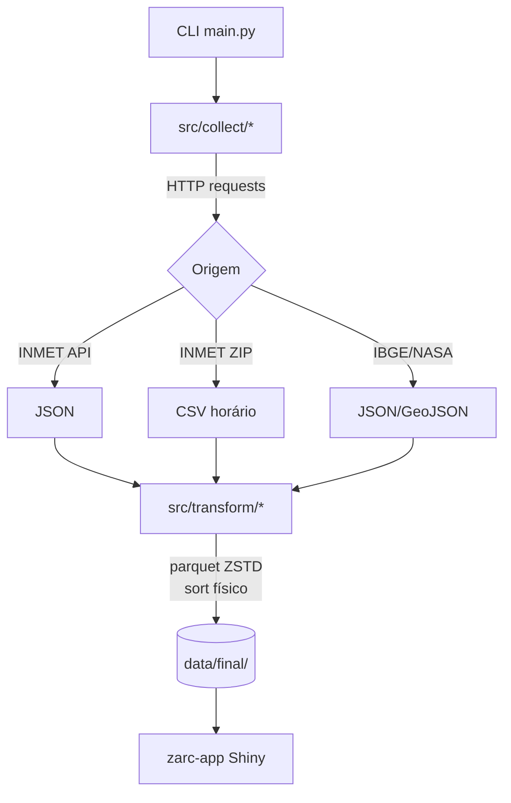

# Arquitetura

## Por que separar do `zarc-app`?

O `zarc-app` (R/Shiny, Rhino) executava ingestão ao vivo a cada sessão. Custos:

- Latência e instabilidade da API do INMET por requisição do usuário.
- Rate limiting e dependência de rede no caminho crítico do Shiny.
- Pipeline histórico (`docs/pipeline_inmet_parquet.qmd`) com paths hardcoded
  `D:/Angelo/...`, sem orquestração reproduzível.

`zarc-etl` é batch, determinístico, roda em qualquer host com Docker, e produz
parquets imutáveis. O Shiny passa a ser pura visualização.

## Stack

- **Python 3.12** + **Polars 1.x** — DataFrame columnar de alta performance,
  sem GIL no caminho crítico, IO eficiente para Parquet via PyArrow.
- **DuckDB 1.x** — usado **apenas** na acumulação do histórico INMET (mesma
  estratégia da `pipeline_inmet_parquet.qmd`) por causa do drift de schema
  entre 25 anos de CSVs. `INSERT BY NAME` + `COPY ... PARQUET` é simples e
  resiliente.
- **PyArrow** — engine de leitura/escrita de Parquet.
- **shapely 2** — `wkb.dumps()` para serializar geometrias em coluna binária.
- **requests + urllib3.Retry** — HTTP com backoff (3 tentativas, status
  `429,500,502,503,504`).

## Por que parquet (e não CSV/JSON)?

Para queries do Shiny (filtrar por estação, por período, por estado):

- **Compressão ZSTD level 3** — taxa próxima de gzip-9 com leitura ~3× mais
  rápida.
- **Row groups de 100k linhas** — equilibra predicate pushdown (mais row groups
  = mais skip) e overhead de metadata.
- **Sort físico** antes do `COPY`: histórico INMET ordenado por
  `(cd_estacao, data)`; milk production por `(geo_level, year, code)`. Com
  estatísticas min/max por row group, queries por estação saltam blocos sem
  ler disco.
- **Dictionary encoding** (default) para colunas categóricas (`cd_estacao`,
  `sg_estado`, `geo_level`).
- **Geometria como WKB** (não GeoJSON) em coluna `Binary`. R lê com
  `sf::st_as_sfc(wkb_col, crs = 4326)` — sem parse JSON repetido.

## Fluxo de dados

## Layout de diretórios

- `src/collect/` — apenas HTTP + cache em disco. Nenhuma transformação.
- `src/transform/` — parsing, QC, ITU, agregações, escrita de parquet.
- `src/utils.py` — sessão HTTP com retry, paths, logger, normalização de nomes
  de colunas.
- `data/raw/` — bytes brutos (ZIPs, JSON, GeoJSON). Cache idempotente.
- `data/interim/` — CSVs descompactados, `inmet_temp.duckdb`. Descartável.
- `data/final/` — parquets de saída, contratos estáveis.
