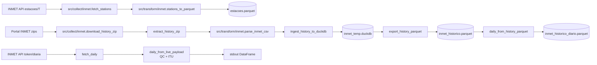

# Pipeline INMET

Três produtos parquet, três fontes distintas. Tudo em
`src/{collect,transform}/inmet.py`.



## 1. Estações

```bash
docker compose run --rm etl inmet-stations
```

Hit `https://apitempo.inmet.gov.br/estacoes/T` com User-Agent de browser
(idêntico a `app/logic/inmet.R:16-20`). Drop linhas com `vl_latitude`/
`vl_longitude` nulos. Ponto WGS84 EPSG:4326 serializado como WKB em coluna
`geometry`.

**Saída**: `estacoes.parquet` — ver [contratos](06-contratos-de-dados.md#estacoesparquet).

## 2. Histórico raw hourly

```bash
docker compose run --rm etl inmet-history --years 2000-2025
```

Réplica fiel de `docs/pipeline_inmet_parquet.qmd` §3-§6 (no repo zarc-app).
Etapas:

1. **Download** dos ZIPs em `https://portal.inmet.gov.br/uploads/dadoshistoricos/{ano}.zip`
   → `data/raw/inmet/{ano}.zip`. Idempotente (skip se existir).
2. **Extração** dos CSVs em `data/interim/inmet/{ano}/`.
3. **Parse** com `parse_inmet_csv` (`src/transform/inmet.py`):
   - Decode bytes como `latin-1` com `errors="backslashreplace"`.
   - Detecção do header pela primeira linha que casa `^Data[;(]|^DATA \(`.
     Anos antigos (2000-2019) usam `DATA (YYYY-MM-DD);HORA (UTC);...`; anos
     recentes (2020+) usam `Data;Hora UTC;...`.
   - `polars.read_csv` com `;` separator, `,` decimal, NA list `["", "NA",
     "-9999", "-9999,0"]`, `infer_schema_length=0` (tudo string).
   - Normalização de colunas via `normalize_colname()` em `src/utils.py`:
     `Latin-ASCII fold + lowercase + colapso de não-alnum em '_'`.
   - `data_yyyy_mm_dd` → `data` (harmoniza schema antigo/novo).
   - `cd_estacao` extraído via regex `[A-Z]\d{3}` do nome do arquivo.
4. **Ingestão** em DuckDB persistente
   `data/interim/inmet_temp.duckdb`, tabela `tabela_clima`. `INSERT BY NAME`
   tolera drift entre anos (anos novos podem ter colunas que anos antigos não
   tinham — `ALTER TABLE ADD COLUMN` em runtime).
5. **Export** único `COPY tabela_clima TO '...inmet_historico.parquet'
   (FORMAT PARQUET, COMPRESSION ZSTD, ROW_GROUP_SIZE 100000)`, com
   `ORDER BY cd_estacao, data` para ativar predicate pushdown no Shiny.
6. **Cleanup**: `inmet_temp.duckdb` é removido (não é versionado).

**Por que tudo VARCHAR no histórico?** Os CSVs do INMET de 25 anos têm
cabeçalhos, separadores e tipos diferentes. Manter como string evita falhas
em runtime — DuckDB e Polars castam para `DOUBLE`/`DATE` na hora da query
(via `CAST(col AS DOUBLE)` ou `pl.col(...).cast(pl.Float64)`).

**Saída**: `inmet_historico.parquet` — schema completo em
[contratos](06-contratos-de-dados.md#inmet_historicoparquet).

## 3. Diário derivado (QC + ITU)

```bash
docker compose run --rm etl inmet-history-daily
```

Lê `inmet_historico.parquet` em modo lazy (Polars), faz cast para float,
aplica QC + agregação diária + ITU.

- **QC** (faixas idênticas a `app/logic/inmet.R:248-269`):
  - Temperatura ∈ [-10, 50] °C → fora dessa faixa = null.
  - Umidade ∈ [0, 100] % → fora dessa faixa = null.
- **Agregação por (cd_estacao, data)**:
  - `temp_med = mean(temperatura_do_ar_bulbo_seco_horaria_c)`.
  - `temp_max = max(temperatura_do_ar_bulbo_seco_horaria_c)`.
  - `umid_med = mean(umidade_relativa_do_ar_horaria)`.
  - `umid_min = min(umidade_relativa_do_ar_horaria)`.
- **ITU (Buffington 1977)** — `compute_itu()` em `src/transform/inmet.py`:
  - `itu_med = 0.8*temp_med + (umid_med*(temp_med-14.3))/100 + 46.3`.
  - `itu_max = 0.8*temp_max + (umid_min*(temp_max-14.3))/100 + 46.3`.

A mesma `compute_itu()` é reutilizada na rota ao vivo (item 4) — única fonte
de verdade.

**Saída**: `inmet_historico_diario.parquet`.

## 4. Diário ao vivo (debug / fallback)

```bash
docker compose run --rm etl inmet-live --code A001 --start 2024-01-01 --end 2024-12-31
```

Hit `https://apitempo.inmet.gov.br/token/estacao/diaria/{start}/{end}/{code}/{token}`.
Aplica o mesmo QC + ITU. Imprime DataFrame em stdout (não escreve parquet por
padrão). `INMET_TOKEN` obrigatório.

## Referências cruzadas (zarc-app)

| Função zarc-app | Função zarc-etl | Arquivo R | Linhas |
|---|---|---|---|
| `get_stations()` | `fetch_stations` + `stations_to_parquet` | `app/logic/inmet.R` | 32-97 |
| `fetch_climate_data()` | `fetch_daily` + `daily_from_live_payload` | `app/logic/inmet.R` | 160-287 |
| `read_inmet_csv()` (qmd) | `parse_inmet_csv` | `tests/test_pipeline_inmet.R` | 210-276 |
| `tabela_clima` (qmd) | `ingest_history_to_duckdb` + `export_history_parquet` | `docs/pipeline_inmet_parquet.qmd` | §6 |
| `filter_stations()` | (não migra — é view) | `app/logic/inmet.R` | 108-144 |
| `buffer_polygon()` | (não migra — é view) | `app/logic/inmet.R` | 299-314 |
