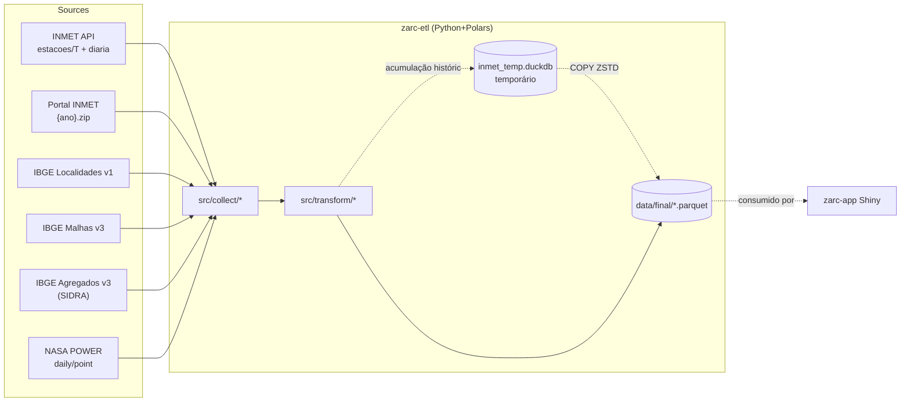

# zarc-etl — wiki

> Estes documentos são a fonte autoritativa para `zarc-etl`. Devem ser
> mantidos em sincronia com `/home/wizard/google_drive/docs/Embrapa/wiki/zarc-etl/`
> na máquina do pesquisador (Google Drive desktop sync).

## O que é

Pipeline batch em Python+Polars que coleta dados de INMET, IBGE e NASA POWER e
materializa-os em parquets locais consumidos pelo `zarc-app` (R/Shiny).

## Forma da mudança

## Documentos

| # | Documento | Conteúdo |
|---|---|---|
| 01 | [arquitetura](01-arquitetura.md) | Decisões: separação do `zarc-app`, Polars+DuckDB, ZSTD+row groups+sort, WKB. |
| 02 | [docker](02-docker.md) | Build, run, volumes, troubleshooting. |
| 03 | [pipeline INMET](03-pipeline-inmet.md) | Estações, histórico raw hourly, derivado diário com QC + ITU. |
| 04 | [pipeline IBGE](04-pipeline-ibge.md) | Localidades, Malhas (WKB), SIDRA (limites + parsing). |
| 05 | [pipeline NASA POWER](05-pipeline-nasa-power.md) | Endpoint, parâmetros, exemplo de uso. |
| 06 | [contratos de dados](06-contratos-de-dados.md) | Schemas de cada parquet em `data/final/`. |
| 07 | [runbook](07-runbook.md) | Operação rotineira (atualização anual, manutenção). |
| 08 | [integração com zarc-app](08-integracao-zarc-app.md) | **Stub** — preenchido na próxima entrega. |

## Status atual das fontes

| Fonte | Coleta | Transform | Parquet de saída |
|---|---|---|---|
| INMET estações (API) | ok | ok | `estacoes.parquet` |
| INMET histórico (ZIPs) | ok | ok (raw hourly) | `inmet_historico.parquet` |
| INMET diário derivado | n/a | ok (QC + ITU) | `inmet_historico_diario.parquet` |
| INMET diário ao vivo (API) | ok | ok (QC + ITU em memória) | (não escreve por padrão) |
| IBGE Localidades | ok | ok | `ibge_localidades_*.parquet` |
| IBGE Malhas | ok | ok (WKB) | `ibge_malhas_*.parquet` |
| IBGE SIDRA leite | ok | ok | `milk_production.parquet` |
| NASA POWER | ok | ok | `nasa_power_*.parquet` |
